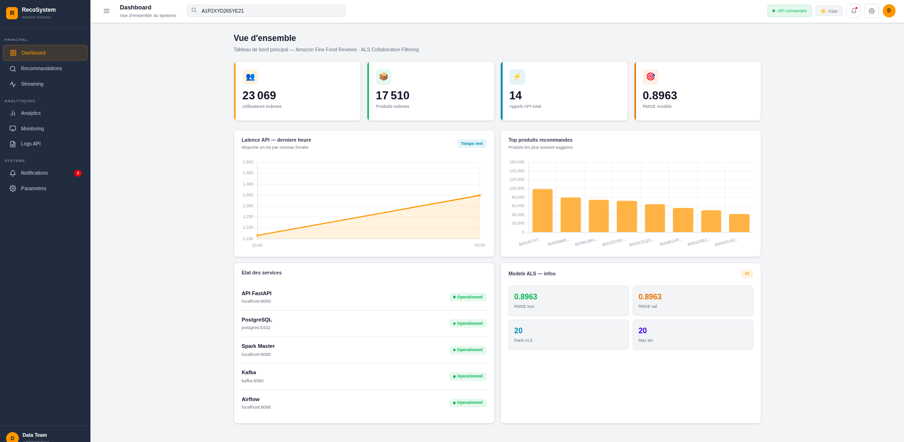
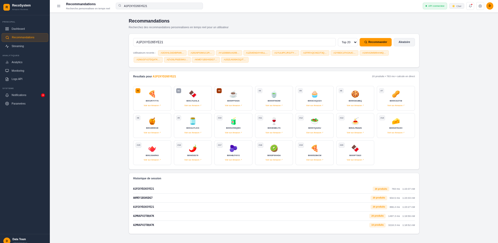
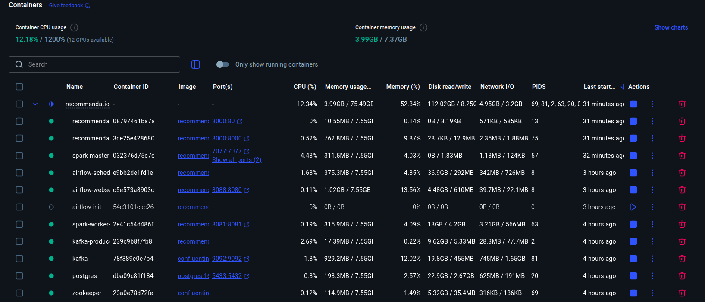
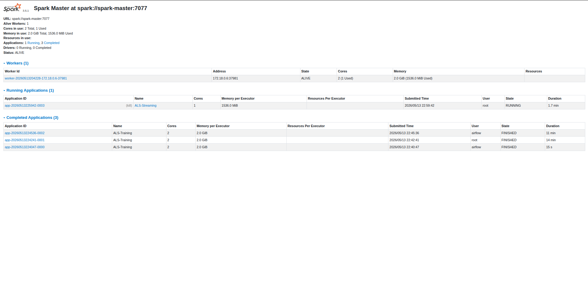
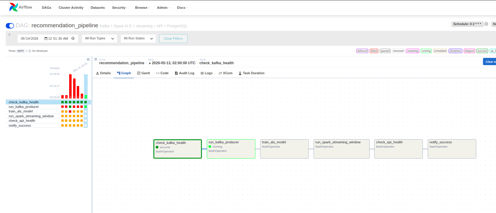

# Systeme de Recommandation Big Data — Amazon Reviews

[](https://spark.apache.org/)
[](https://kafka.apache.org/)
[](https://airflow.apache.org/)
[](https://fastapi.tiangolo.com/)
[](https://www.postgresql.org/)
[](https://www.docker.com/)

> Pipeline de recommandation temps reel complet base sur **ALS (Alternating Least Squares)** de Spark MLlib, avec streaming Kafka, orchestration Airflow, API FastAPI et dashboard moderne.

**Resultats obtenus sur le dataset Amazon Fine Food Reviews :**
- 23 069 utilisateurs indexes · 17 510 produits · 568 454 avis
- RMSE = **0.8963** (test set, CrossValidator 8 combinaisons x 3 folds)
- 1 766 660 recommandations persistees dans PostgreSQL
- Latence API moyenne : ~200 ms (session Spark locale)

---

## Table des matieres

- [Architecture](#architecture)
- [Technologies](#technologies)
- [Prerequis](#prerequis)
- [Demarrage rapide](#demarrage-rapide)
- [Structure du projet](#structure-du-projet)
- [Configuration](#configuration)
- [Utilisation](#utilisation)
- [Endpoints API](#endpoints-api)
- [Dashboard](#dashboard)
- [Pipeline Airflow](#pipeline-airflow)
- [Monitoring](#monitoring)
- [Depannage](#depannage)

---

## Architecture

```
Reviews.csv
    │
    ▼
┌─────────────────┐     ┌──────────────────────┐
│  Kafka Producer │────▶│  Kafka Topic: reviews │
└─────────────────┘     └──────────┬───────────┘
                                   │
              ┌────────────────────┼────────────────────┐
              ▼                                         ▼
  ┌───────────────────────┐             ┌───────────────────────────┐
  │  Spark ALS Training   │             │  Spark Structured Stream  │
  │  (train_als.py)       │             │  (streaming.py)           │
  │  CrossValidator       │             │  micro-batch 30s          │
  └──────────┬────────────┘             └─────────────┬─────────────┘
             │                                        │
             ▼                                        ▼
  ┌─────────────────────┐              ┌──────────────────────────┐
  │  ALS Model + Indexer│              │  PostgreSQL               │
  │  (Docker volume)    │              │  stream_events            │
  └──────────┬──────────┘              │  recommendations          │
             │                         │  model_metrics            │
             ▼                         │  api_logs                 │
  ┌─────────────────────┐              └──────────────────────────┘
  │  FastAPI (port 8000)│◀─────────────────────┘
  │  PySpark local[2]   │
  └──────────┬──────────┘
             │
             ▼
  ┌─────────────────────┐
  │  Nginx (port 3000)  │  ◀── Dashboard SPA (frontend/)
  │  proxy /api/ → 8000 │
  └─────────────────────┘

Orchestration : Apache Airflow (port 8088)
               DAG quotidien 02h00 UTC
```

---

## Technologies

| Composant | Technologie | Version |
|-----------|-------------|---------|
| Machine Learning | Apache Spark MLlib — ALS | 3.5.1 |
| Streaming | Spark Structured Streaming + Kafka | 3.5.1 |
| Ingestion | Apache Kafka + Zookeeper | 7.4.0 |
| Orchestration | Apache Airflow | 2.9.1 |
| API | FastAPI + PySpark (local) | FastAPI 0.111 |
| Base de donnees | PostgreSQL | 16 |
| Frontend | Nginx + SPA vanilla JS + Chart.js | - |
| Containerisation | Docker + Docker Compose | - |

---

## Prerequis

- **Docker** >= 24.0
- **Docker Compose** >= 2.20 (plugin `docker compose`, pas `docker-compose`)
- **RAM** : 8 Go minimum — 16 Go recommande
- **CPU** : 4 cores minimum
- **Disque** : 10 Go libres

---

## Demarrage rapide

### 1. Cloner le depot

```bash
git clone https://github.com/imanelujen/recommendationSystem-Kafka-Spark.git
cd recommendationSystem-Kafka-Spark
```

### 2. Obtenir le dataset

Telecharger [Amazon Fine Food Reviews](https://www.kaggle.com/datasets/snap/amazon-fine-food-reviews) et placer le fichier dans `data/Reviews.csv`.

```bash
mkdir -p data
# Placer Reviews.csv dans data/
```

### 3. Configurer l'environnement

```bash
cp .env.example .env

# Generer une cle Fernet pour Airflow
python3 -c "from cryptography.fernet import Fernet; print(Fernet.generate_key().decode())"
# Copier la valeur dans .env → AIRFLOW__CORE__FERNET_KEY=...
```

### 4. Demarrer tous les services

```bash
docker compose up -d --build
```

Premier demarrage : ~5-10 minutes (telechargement des images + build).

```bash
# Verifier que tous les services sont up
docker compose ps
```

Services attendus :

| Conteneur | Port | Etat |
|-----------|------|------|
| `postgres` | 5433 | healthy |
| `kafka` | 9092 | running |
| `zookeeper` | 2181 | running |
| `spark-master` | 8080, 7077 | healthy |
| `spark-worker-1` | 8081 | running |
| `airflow-webserver` | 8088 | running |
| `airflow-scheduler` | — | running |
| `recommendation-api` | 8000 | running |
| `recommendation-frontend` | 3000 | running |

### 5. Lancer l'entrainement ALS

```bash
# Depuis le conteneur spark-master (qui a le driver PostgreSQL)
docker exec -it spark-master spark-submit \
  --master spark://spark-master:7077 \
  --deploy-mode client \
  --driver-memory 2g \
  --executor-memory 2g \
  /opt/spark-apps/train_als.py
```

Duree : ~5-15 minutes selon les ressources. A la fin, le modele est sauvegarde dans le volume Docker et l'API charge automatiquement.

### 6. Acceder aux interfaces

| Interface | URL | Identifiants |
|-----------|-----|-------------|
| **Dashboard** | http://localhost:3000 | — |
| **API Swagger** | http://localhost:8000/docs | — |
| **Airflow** | http://localhost:8088 | admin / admin |
| **Spark Master UI** | http://localhost:8080 | — |
| **Spark Worker UI** | http://localhost:8081 | — |

---

## Structure du projet

```
recommendationSystem/
│
├── api/                        # Service API FastAPI
│   ├── main.py                 # Endpoints REST + logique PySpark
│   ├── requirements.txt        # Dependances Python
│   └── Dockerfile
│
├── airflow/                    # Orchestration
│   ├── dags/
│   │   └── recommendation_dag.py   # DAG pipeline complet
│   └── Dockerfile
│
├── frontend/                   # Dashboard SPA
│   ├── index.html              # Interface complete (vanilla JS + Chart.js)
│   ├── nginx.conf              # Proxy /api/ → FastAPI
│   └── Dockerfile
│
├── kafka/                      # Producteur Kafka
│   ├── producer.py             # Envoie Reviews.csv vers topic "reviews"
│   └── Dockerfile
│
├── spark/                      # Applications Spark
│   ├── train_als.py            # Entrainement ALS + CrossValidator
│   ├── streaming.py            # Streaming Kafka → PostgreSQL
│   ├── create_indexer.py       # Utilitaire indexer seul
│   ├── pg_sync.py              # Synchronisation vers PostgreSQL
│   └── Dockerfile
│
├── postgres/
│   └── init/
│       ├── 01-create-airflow-db.sql      # Base airflow
│       └── 02-recommendation-schema.sql  # Schema applicatif
│
├── data/                       # Dataset (non versionne)
│   └── Reviews.csv             # Amazon Fine Food Reviews
│
├── images/                     # Captures d'ecran documentation
│
├── docker-compose.yml          # Orchestration des services
├── .env.example                # Template variables d'environnement
├── .gitignore
├── COMMANDS.md                 # Reference commandes avancees
└── README.md
```

---

## Configuration

### Variables d'environnement (`.env`)

```bash
# Kafka
KAFKA_BOOTSTRAP_SERVERS=kafka:9092
KAFKA_TOPIC=reviews
DELAY_SECONDS=0             # 0 = le plus rapide possible

# Spark
SPARK_MASTER_URL=spark://spark-master:7077
SPARK_WORKER_MEMORY=2G
SPARK_WORKER_CORES=2

# PostgreSQL
POSTGRES_USER=bigdata
POSTGRES_PASSWORD=bigdata

# Airflow
AIRFLOW__CORE__FERNET_KEY=<generer avec python3 -c "from cryptography.fernet import Fernet; print(Fernet.generate_key().decode())">
AIRFLOW_ADMIN_USER=admin
AIRFLOW_ADMIN_PASSWORD=admin

# API
TOP_N=10
```

### Schema PostgreSQL

Quatre tables creees automatiquement au demarrage :

| Table | Description |
|-------|-------------|
| `recommendations` | Recommandations generees (user_id, product_id, predicted_rating) |
| `stream_events` | Evenements consommes depuis Kafka |
| `model_metrics` | RMSE, rank, max_iter par entrainement |
| `api_logs` | Chaque appel API avec latence et statut |

---

## Utilisation

### Recommandations via API

```bash
# Obtenir 10 recommandations pour un utilisateur
curl "http://localhost:8000/recommendations/user/A3SGXH7AUHU8GW?top_n=10"

# Reponse
{
  "user_id": "A3SGXH7AUHU8GW",
  "recommendations": ["B001E4KFG0", "B00813GRG4", "B000LQOCH0", ...],
  "count": 10,
  "model_used": "ALS",
  "latency_ms": 187.4,
  "cached": false
}
```

```bash
# Echantillon d'utilisateurs connus
curl "http://localhost:8000/users/sample?n=5"

# Sante de l'API
curl "http://localhost:8000/health"

# Statistiques globales
curl "http://localhost:8000/stats"
```

### Lancer le streaming manuellement

```bash
docker exec -it spark-master spark-submit \
  --master spark://spark-master:7077 \
  --packages org.apache.spark:spark-sql-kafka-0-10_2.12:3.5.1 \
  --executor-memory 1536m \
  --executor-cores 1 \
  /opt/spark-apps/streaming.py
```

Le streaming tourne en mode micro-batch (30 secondes) et s'arrete apres timeout (via Airflow) ou Ctrl+C.

### Produire des messages Kafka

```bash
docker exec -it kafka-producer python /app/producer.py
```

---

## Endpoints API

| Methode | Endpoint | Description |
|---------|----------|-------------|
| GET | `/health` | Etat de l'API, modele charge, PostgreSQL |
| GET | `/stats` | Statistiques globales (users, produits, RMSE, appels) |
| GET | `/recommendations/user/{user_id}` | Top-N recommandations |
| GET | `/users/sample?n=10` | Echantillon d'utilisateurs valides |
| GET | `/debug/check/{user_id}` | Verifier si un utilisateur est indexe |
| GET | `/analytics/top-products?limit=10` | Produits les plus recommandes |
| GET | `/analytics/requests-per-hour` | Historique requetes 24h |
| GET | `/analytics/model-metrics` | Historique RMSE du modele |
| GET | `/monitoring/services` | Etat TCP des services |
| GET | `/streaming/stats` | Statistiques evenements Kafka |
| GET | `/streaming/live?limit=20` | Derniers evenements stream |
| GET | `/logs/api?limit=50` | Historique appels API avec latences |

Documentation interactive : http://localhost:8000/docs

---

## Dashboard

Le dashboard (http://localhost:3000) est une SPA vanilla JS avec sidebar de navigation et theme Amazon. Il comprend 8 pages :

| Page | Contenu |
|------|---------|
| **Dashboard** | KPIs (utilisateurs, produits, appels, RMSE), graphiques latence et top produits, etat services |
| **Recommandations** | Recherche par userId, selection aleatoire, grille de produits avec emojis, historique de session |
| **Streaming** | Flux live Kafka en temps reel, distribution des scores, statistiques |
| **Analytics** | Requetes/heure, latence/heure, top-10 produits, historique RMSE |
| **Monitoring** | Etat des services, detail technique du modele, liens rapides |
| **Logs** | Historique des appels API avec statuts et latences |
| **Notifications** | Evenements systeme (entrainement, streaming, pipeline) |
| **Parametres** | Theme clair/sombre, couleur d'accent, image de fond, logo personnalisable |

Screenshots :







---

## Pipeline Airflow

Le DAG `recommendation_pipeline` s'execute automatiquement chaque nuit a **02h00 UTC**.

```
check_kafka_health
        │
        ▼
run_kafka_producer     (timeout 5 min — envoie Reviews.csv vers Kafka)
        │
        ▼
train_als_model        (timeout 2h — entrainement ALS + CrossValidator)
        │
        ▼
run_spark_streaming    (timeout 10 min — fenetre streaming 3 min)
        │
        ▼
check_api_health       (polling jusqu'a model_loaded: true)
        │
        ▼
notify_success
```

### Lancer manuellement via Airflow

1. Ouvrir http://localhost:8088 (admin / admin)
2. Activer le DAG `recommendation_pipeline`
3. Cliquer **Trigger DAG**

Ou depuis le terminal :

```bash
docker exec -it airflow-scheduler \
  airflow dags trigger recommendation_pipeline
```

---

## Monitoring

```bash
# Etat de tous les conteneurs
docker compose ps

# Logs en temps reel
docker compose logs -f api
docker compose logs -f spark-master
docker compose logs -f airflow-scheduler

# Statistiques ressources
docker stats

# Verifier le modele dans PostgreSQL
docker exec -it postgres psql -U bigdata -d recommendation \
  -c "SELECT COUNT(*) as users FROM recommendations GROUP BY user_id LIMIT 1;"

# Verifier les metriques
docker exec -it postgres psql -U bigdata -d recommendation \
  -c "SELECT rmse, rank, max_iter, created_at FROM model_metrics ORDER BY created_at DESC LIMIT 5;"
```

---

## Depannage

### API retourne `model_loaded: false`

Le modele se charge en arriere-plan apres le demarrage du conteneur. Attendre ~60 secondes, puis :

```bash
curl http://localhost:8000/health
# Si toujours false : le modele n'a pas ete entraine
docker exec -it spark-master spark-submit \
  --master spark://spark-master:7077 \
  --driver-memory 2g --executor-memory 2g \
  /opt/spark-apps/train_als.py
```

### Erreur `ClassNotFoundException: org.postgresql.Driver`

Le driver PostgreSQL n'est present que dans l'image `spark-master`. Toujours lancer `spark-submit` depuis ce conteneur :

```bash
# Correct
docker exec -it spark-master spark-submit ...

# Incorrect (pas de driver PG dans ce conteneur)
docker exec -it airflow-scheduler spark-submit ...
```

### Le dashboard affiche "—" pour tous les KPIs

Verifier que le proxy Nginx fonctionne :

```bash
curl http://localhost:3000/api/health
# Doit retourner le JSON de l'API, pas du HTML
```

Si la reponse est du HTML, rebuilder le frontend :

```bash
docker compose up -d --build frontend
```

### Kafka producer trop lent (DAG en up_for_retry)

S'assurer que `DELAY_SECONDS=0` dans `.env` et que le timeout est suffisant. Avec 568 454 messages et delai 0, le producteur prend ~3-4 minutes.

### Memoire insuffisante pour Spark

```bash
# Augmenter dans docker-compose.yml
SPARK_WORKER_MEMORY=4G

# Puis redemarrer
docker compose restart spark-master spark-worker-1
```

### Reinitialiser completement

```bash
docker compose down -v          # Supprime les volumes (modele + donnees)
docker compose up -d --build    # Repart de zero
```


